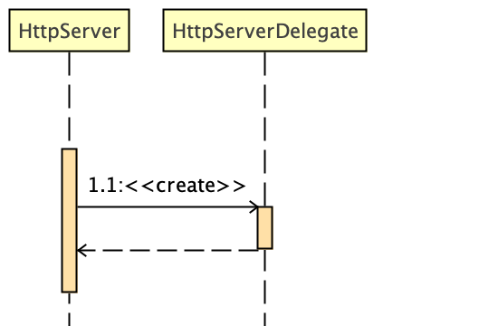
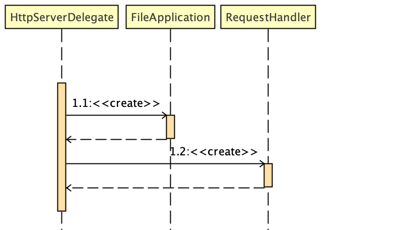

## Key Design Decisions
* Used ExecutorService threadPool for better usage and management of threads
* Used ArrayBlockingQueue instead of default LinkedBlockingQueue to enforce a blocking
  behaviour and reject tasks that are beyond threshhold(200).
* Dates are RFC1123 compliant -used  a common Utility class for all conversion
* Used Java.Util.Logging for internal logging to keep the jar lightweight and also to
  avoid conflict due to application(hosted on server) logging. Apache Tomcat avoids log4j2/logback
  for the same reason.
* Used MD5 hash of file content to derive etag value.
* Used file extension to drive content type as there is a bughttps://bugs.java.com/bugdatabase/view_bug.do?bug_id=8129632.So either
  will upgrade to jdk9 or use https://github.com/j256/simplemagic.  
* Used BufferedReader and BufferedWriter for reading content and streaming out. 
  At at time char buffer size is kept to 1024 for minimal memory footprint. 
* Used Pojo (http package) for ease of implementation and extensibility.
* Used Junit framework to write unit test cases. The Test cases are mandatory to pass for a successful
  build.
* Used Github versioning and PR for merge and developement.

### SequenceDiagrams

